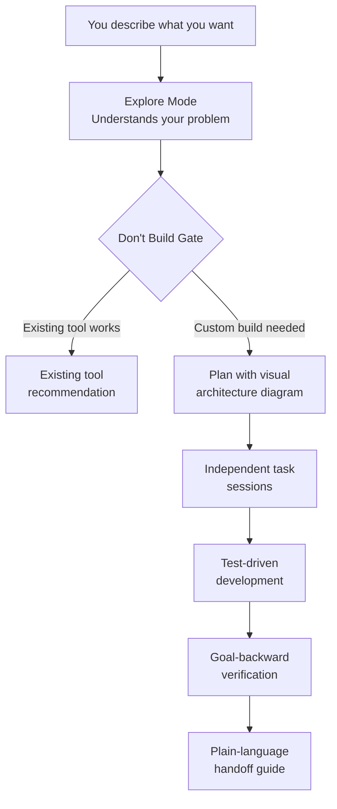

<div align="center">

# NORMIES

**Claude Code for people who aren't engineers.**

A desktop app that turns ideas into working software — without requiring you to know how to code. You describe what you want. Normies figures out the best way to get there, builds it, and verifies it actually works.


[Why This Exists](#why-this-exists) · [How It Works](#how-it-works) · [Engineering Decisions](#key-engineering-decisions) · [Architecture](#architecture) · [Documentation](docs/)

<!-- TODO: Add hero screenshot of Normies in action -->

</div>

---

## Why This Exists

There's a massive gap between "I know exactly what I need" and "I can build it myself."

AI coding tools are incredibly powerful now. Claude Code can build real software — APIs, automations, full applications. But it's built for engineers. If you don't know what a repository is, or how to read an error message, or what "run the tests" means, Claude Code is a Ferrari with no steering wheel.

**Normies is the steering wheel.**

It wraps Claude Code in a desktop app that speaks your language, guides you through decisions, and handles all the technical complexity behind the scenes. You bring the idea and the business context. Normies handles the engineering.

**This isn't a no-code tool.** No-code tools limit what you can build. Normies has the full power of Claude Code underneath — it just makes that power accessible to people who aren't engineers.

**This isn't a chatbot.** Chatbots give you answers. Normies builds you working systems — connected to your real tools, tested, verified, and ready to use.

---

## Who This Is For

Business owners, operators, and professionals who:

- Know exactly what they need but can't build it themselves
- Are tired of paying developers $5,000 for a simple automation
- Have tried no-code tools and hit the ceiling
- Want real, working solutions — not just advice

**Not for:** Engineers who want a better IDE. Use Claude Code directly — it's great. Normies is for the people who would never open a terminal.

---

## How It Works

<details>
<summary><strong>1. Describe What You Want</strong></summary>

Start a conversation. Describe your problem in plain English.

Normies doesn't just take your first description and run with it. It asks follow-up questions — one at a time, never overwhelming — until it truly understands what you need.

> **You:** "I want to find companies posting jobs and route them to my sales team."
>
> **Normies:** "Got it — where are you finding these job postings today? What happens after a lead reaches your team?"

It's not a form. It's a conversation. The kind you'd have with a technical friend who actually listens.

</details>

<details>
<summary><strong>2. Get an Honest Recommendation</strong></summary>

Here's what most AI tools won't do: **tell you not to build something.**

Before writing a single line of code, Normies considers whether you even need custom software:

- **Existing tool does it?** → "Just use Zapier for this. Here's how to set it up."
- **No-code platform works?** → "n8n can handle this workflow. Let me walk you through it."
- **Custom code needed?** → "OK, this actually needs to be built. Here's the plan."

We call this the **"Don't Build" Gate.** It exists because the best solution is often the simplest one, and building custom software when a $20/month tool already exists is a waste of everyone's time.

</details>

<details>
<summary><strong>3. Review the Plan</strong></summary>

When building IS the right answer, Normies creates a plan you can actually understand:

- **What we're building** — in plain English, not technical jargon
- **How the pieces connect** — visual diagrams with labels like "Where your data lives" not "PostgreSQL instance"
- **What happens in what order** — numbered tasks with time estimates
- **What could go wrong** — honest about complexity, not hiding difficulty

You review it. Ask questions. Request changes. Nothing gets built until you say "looks good."

</details>

<details>
<summary><strong>4. Watch It Get Built</strong></summary>

Each task from the plan becomes its own focused work session:

- Tasks run independently — each one gets fresh context, so quality stays high from first task to last
- Tests are written before code — if it can break, there's a test proving it works
- Every task verifies its own work — no "trust me, it's done"
- You see progress in real-time — what's done, what's in progress, what's next

You can check in anytime, but you don't have to babysit. When a task hits something unexpected, it stops and asks rather than guessing.

</details>

<details>
<summary><strong>5. Get the Handoff</strong></summary>

When everything's built, you get a plain-language guide:

- **What was built** and how the pieces connect
- **How to verify it works** — click this, see that
- **What could break** and how to fix it
- **How to change things later** — which parts are easy to modify vs. which need help

No "here's the repo, good luck." An actual explanation of what you now own.

</details>

---

## Key Engineering Decisions

Normies looks simple on the surface. That's the point. Under the hood, there are specific engineering decisions that make AI-built software reliable.

### Context Engineering — Fresh Sessions Per Task

**Problem:** AI quality degrades as conversations get longer.

**Solution:** Every task gets its own fresh session with 200k tokens of context. Planning is separate from building is separate from review. No context pollution, no degradation.

**Why it matters:** Task #15 gets the same quality as Task #1.

### Goal-Backward Verification

**Problem:** Tests passing doesn't mean the feature works.

**Solution:** After standard testing, we check backward from the user's goal: Does each piece exist? Is it real code (not stubs)? Is it actually connected to the rest of the system?

**Why it matters:** Catches the #1 source of "it works on my machine" bugs — code that exists but isn't wired to anything.

### Structured Task Format

**Problem:** Ambiguous instructions produce ambiguous results.

**Solution:** Every task has four mandatory sections: Files (what to touch), Action (step-by-step instructions), Verify (the exact command to prove it works), Done (measurable acceptance criteria).

**Why it matters:** No "figure it out." The building agent knows exactly what to do and what done looks like.

### Graduated Permission System

**Problem:** Users need to trust the AI before giving it autonomy.

**Solution:** Three modes — Explore (read-only), Ask to Edit (approval per change), Execute (full autonomy). Start cautious, upgrade as trust builds.

**Why it matters:** Users are never surprised by what happened while they weren't looking.

---

## Architecture



| Component | What It Does |
|-----------|-------------|
| **Explore Mode** | Understands your problem through conversation before doing anything |
| **Don't Build Gate** | Recommends existing tools when custom code isn't needed |
| **Plan** | Creates a visual, plain-language blueprint you approve before work starts |
| **Task Sessions** | Each task runs in its own isolated session for consistent quality |
| **Test-Driven Development** | Tests are written before code — proving things work, not hoping they do |
| **Goal-Backward Verification** | Checks that every piece exists, is real, and is actually connected |
| **Handoff Guide** | Plain-language summary of what was built and how to use it |

---

<details>
<summary><strong>What Makes It Different</strong></summary>

### It Speaks Your Language

Every other AI coding tool assumes you're an engineer. Normies assumes you're not.

| Other tools say | Normies says |
|-----------------|-------------|
| "Database migration failed" | "The place where your data lives needs to be updated — here's what that means and what we do about it" |
| "Auth middleware configured" | "The login system is set up" |
| "Run `npm test`" | "I ran the tests — 24 out of 24 passed. Everything's working." |
| "PR ready for review" | "The work is done. Here's what changed and how to verify it." |

This isn't dumbing things down. It's communicating clearly. There's a difference.

### It's Honest About Difficulty

Every other tool promises everything is easy. That's a lie, and it destroys trust when things go sideways.

Normies flags difficulty upfront:

- **"This is straightforward"** — should work without surprises
- **"This part has some complexity"** — here's what could go wrong and our backup plan
- **"This is genuinely hard"** — here's why, here's the realistic timeline, and here's what we do if it doesn't work

Honesty builds trust. Sugarcoating builds resentment.

### It Connects to Your Real Tools

Normies isn't isolated. It plugs into the tools you already use:

- **APIs** — Stripe, Notion, Google Sheets, your CRM, anything with an API
- **MCP Servers** — n8n, databases, custom services
- **OAuth** — Google, Microsoft, Slack — sign in once, stay connected
- **Local files** — spreadsheets, documents, whatever you're working with

It reads from your tools, acts on your data, and builds automations that connect everything together.

</details>

---

## Tech Stack

| Layer | Technology |
|-------|------------|
| Desktop App | Electron + React + TailwindCSS |
| Core Logic | TypeScript (strict mode) |
| AI Engine | Claude Agent SDK + Anthropic API |
| Tool Integration | Model Context Protocol (MCP) |
| Auth | OAuth 2.0 (Google, Microsoft, Slack) |
| Package Manager | Bun |
| Diagram Rendering | Custom Mermaid → SVG pipeline |

---

## Project Structure

```
normies/
├── apps/
│   ├── electron/              # Desktop app (macOS, Windows, Linux)
│   └── viewer/                # Web viewer for shared sessions
├── packages/
│   ├── core/                  # Shared TypeScript types
│   ├── shared/                # Core business logic (agent, auth, config, MCP, prompts, sessions)
│   ├── ui/                    # Shared React UI components
│   └── mermaid/               # Mermaid diagram renderer
├── superpowers/               # Skills, hooks, and agents bundled with the app
├── scripts/                   # Build, release, and dev scripts
└── docs/                      # Documentation
```

---

## Development

**Requirements:** Bun, Node.js 18+

```bash
bun install
bun run electron:dev      # Start in dev mode
bun test                  # Run tests
bun run typecheck         # Type check
bun run lint              # Lint
```

**Build:**

```bash
bun run electron:build    # Build desktop app
bun run electron:start    # Start built app
```

---

## Design Documents

The thinking behind Normies is documented in [docs/design/](docs/design/) — including product research, architecture decisions, and the implementation plan.

---

## Philosophy

Most AI tools try to make engineering disappear. That's dishonest — engineering is hard, and pretending it isn't sets people up for frustration.

Normies takes a different approach: **make engineering accessible, not invisible.** You should understand what's being built, why decisions are being made, and what the trade-offs are. You just shouldn't need a CS degree to participate in those conversations.

The technical friend everyone wishes they had. That's Normies.

---

<div align="center">

**Claude Code is powerful. Normies makes it yours.**

</div>

---

## License

MIT License. See [LICENSE](LICENSE) for details.
